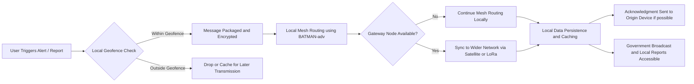

# Project KAVACH

## Overview

**Project KAVACH** (कवच) is a decentralized, offline-first, peer-to-peer (P2P) mesh network designed to provide reliable communication and geofenced intelligence sharing in conflict zones, disaster areas, and remote regions with compromised infrastructure. It uses the BATMAN protocol for efficient multi-hop routing and is built on a Rust backend with a React Native frontend, making it resilient, secure, and fast. The project’s name reflects its purpose as a protective shield for critical communication in unstable and high-risk environments.

---

## Key Features

* **Decentralized Communication:** Operates without central servers, ensuring resilience against infrastructure failures.
* **Geofenced Alerts:** Messages can be restricted to specific geographic regions for localized intelligence.
* **Offline-First Design:** Functions without internet access, using local mesh networks for data exchange.
* **Government Broadcasts:** Receive official updates even in disconnected environments.
* **Community-Driven Reports:** Secure, real-time information sharing within the network.
* **High Resilience:** Self-healing, adaptive routing with dynamic node management.
* **Secure Communication:** End-to-end encryption for all messages.

---

## System Architecture

### Key Components

1. **Edge Nodes (Mobile Devices / Raspberry Pis)**

   * Form the backbone of the mesh network.
   * Use BATMAN-adv for layer 2 routing, WebRTC for P2P communication.
   * Run the Rust networking core with local data caching.

2. **Gateway Nodes (Long-Range Relays / Satellite Uplinks)**

   * Connect isolated mesh networks to wider internet or satellite networks.
   * Use LoRa or satellite uplinks for extended range.

3. **Geofencing Logic**

   * Restricts message visibility based on GPS location or proximity to predefined zones.

4. **Network Management and Health Monitoring**

   * Real-time node status monitoring and self-healing mesh logic.

5. **Security and Encryption Layer**

   * End-to-end encryption using NaCl or AES-256, with digital signatures for message integrity.

6. **Government Broadcast System**

   * Prioritizes official messages within the mesh without requiring centralized servers.

---

## Data Flow



### Data Flow Steps:

1. **Message Creation:** User triggers alert or report from the mobile app.
2. **Local Geofence Check:** Device checks if message is relevant based on current location.
3. **Mesh Routing:** Message is routed through nearby nodes using BATMAN’s decentralized routing.
4. **Gateway Sync:** If a gateway node is within range, message is synced to a wider network.
5. **Data Persistence:** Messages are cached locally for offline access and historical reference.
6. **Acknowledgment:** Delivery confirmation is sent back to the origin node if possible.
7. **Broadcast Access:** Users can access local and government broadcasts directly from the app.

---

## Tech Stack

* **Backend:** Rust (libp2p, batman-adv)
* **Frontend:** React Native, TypeScript
* **Communication:** WebRTC, LoRa, Satellite Uplinks
* **Security:** NaCl, AES-256, Digital Signatures

---

## Getting Started

### Prerequisites

* Rust and Cargo installed
* Node.js and npm
* Docker (optional for containerized deployment)
* Expo CLI for React Native

### Installation

1. **Clone the Repository:**

```bash
git clone https://github.com/sauryagur/kavach.git
cd kavach
```

2. **Install Backend Dependencies:**

```bash
cd backend
cargo build
```

3. **Install Frontend Dependencies:**

```bash
cd frontend
npm install
npx expo install
```

4. **Run the Backend:**

```bash
cargo run
```

5. **Run the Frontend:**

```bash
npx expo start
```

### Configuration

* Use `.env` files for environment-specific settings.
* Include keys for geofencing, WebRTC ICE servers, and encryption settings.

---

## Roadmap

See the full development roadmap [here](./ROADMAP.md).

---

## License

This project is licensed under the MIT License.

---

## Contributing

* Fork the repo
* Create a new branch (`git checkout -b feature/new-feature`)
* Commit your changes (`git commit -m 'Add some feature'`)
* Push to the branch (`git push origin feature/new-feature`)
* Open a Pull Request

---

## Contact

For any questions, feel free to reach out to the project maintainers.

